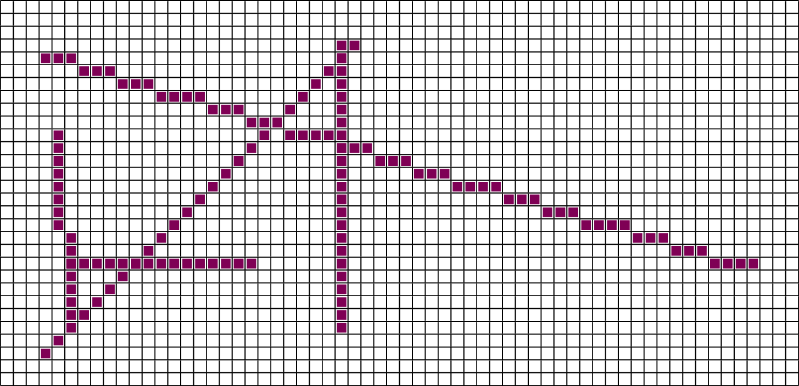

.. _parallel-algorithms:

Parallel Algorithms
===================

In this chapter, we will present a number of parallel algorithms for
solving a number of problems. We will make effective use of the SOAC
parallel array combinators. In particular, it turns out that the
operator is critical for writing parallel algorithms. In fact, we shall
first develop the notion of a *segmented scan* operation, which, as we
shall see, can be implemented using Futhark’s operator, and which in its
own right is essential to many of the later algorithms.

Based on the segmented scan operator and the other Futhark SOAC
operations, but before investigating more challenges algorithms, we also
present a set of utility functions as well as their parallel
implementations.

.. sec:sgmscan:

Segmented Scan
--------------

The segmented scan operator is quite essential as we shall see
demonstrated in many of the algorithms explained later. The segmented
scan operator can be implemented with a simple scan using an
associative function that operates on pairs of values
:cite`Schwartz:1980:ULT:357114.357116,blelloch1990vector`.  Here is
the definition of the segmented scan operation:

.. literalinclude:: src/sgm_scan.fut
   :lines: 5-11

Parallel Utility Functions
--------------------------

For use by other algorithms, a set of utility functions for manipulating
and managing arrays is an important part of the tool box. We present a
number of utility functions here, ranging from finding elements in an
array to finding the maximum element and its index in an array.

Finding the Index of an Element in an Array
~~~~~~~~~~~~~~~~~~~~~~~~~~~~~~~~~~~~~~~~~~~

We device two different functions for finding an index in an array for
which the content is identical to some given value. The first
function, ``find_idx_first``, takes a value ``e`` and an array ``xs``
and returns the smallest index ``i`` into ``xs`` for which ``xs[i] =
e``:

.. literalinclude:: src/find_idx.fut
   :lines: 7-11

The second function, , also takes a value and an array but returns the
largest index ``i`` into ``xs`` for which ``xs[i] = e``:

.. literalinclude:: src/find_idx.fut
   :lines: 13-16

The above two functions make use of the auxiliary functions ``min``
and ``max``:

::

    let max (a:i32) (b:i32): i32 = if a > b then a else b
    let min (a:i32) (b:i32): i32 = if a < b then a else b

These are also present in Futhark’s basis library in
``/futlib/math`` under the names ``i32.max`` and ``i32.min``.

Finding the Largest Element and its Index in an Array
~~~~~~~~~~~~~~~~~~~~~~~~~~~~~~~~~~~~~~~~~~~~~~~~~~~~~

Futhark allows for reduction operators to take tuples as arguments. This
feature is exploited in the following function, which implements a
homomorphism for finding the largest element and its index in an array:

.. literalinclude:: src/maxidx.fut
   :lines: 4-11

The function is a *homomorphism* :cite:`BirdListTh`: For any :math:`x`
and :math:`y`, there exists an associative operator :math:`\oplus`
such that

.. math::
   :nowrap:

   $\kw{maxidx}(x \pp y) = \kw{maxidx}(x) \oplus \kw{maxidx}(y)$

The operator :math:`\oplus = \kw{mx}`.

Radix Sort
----------

A simple radix sort algorithm was presented already in
:ref:`radixsort`. In this section, we present two generalized versions
of radix sort, one for ascending sorting and one for descending
sorting. As a bonus, the sorting routines return both the sorted
arrays and an index array that can be used together with to sort an
array with respect to a permutation obtained by sorting another
array. The generalised ascending radix sort is as follows:

.. literalinclude:: src/rsort_idx.fut
   :lines: 14-31

And the descending version as follows:

.. literalinclude:: src/rsort_idx.fut
   :lines: 33-49

Notice that in case of identical elements in the source vector, one
cannot simply implement the ascending version by reversing the arrays
resulting from calling the descending version.

Finding the Longest Streak
--------------------------

In this section we shall demonstrate two different methods of finding
the longest streak of increasing numbers. One method makes use directly
of a segmented scan and the other method implicitly encodes the
segmented scan as an integrated part of the algorithm. We start by
showing the latter version of the longest streak problem:

.. literalinclude:: src/streak.fut
   :lines: 22-35

The following derivation shows how the algorithm works for a
particular input, namely when ``stream`` is given the argument array
``[1,5,3,4,2,6,7,8]``, in which case the algorithm should return the
value 3:

+----------+---+---+---+---+---+---+---+---+---+
| Variable |   |   |   |   |   |   |   |   |   |
+==========+===+===+===+===+===+===+===+===+===+
| ``xs``   | = | 1 | 5 | 3 | 4 | 2 | 6 | 7 | 8 |
+----------+---+---+---+---+---+---+---+---+---+
| ``ys``   | = | 5 | 3 | 4 | 2 | 6 | 7 | 8 | 1 |
+----------+---+---+---+---+---+---+---+---+---+
| ``is``   | = | 1 | 0 | 1 | 0 | 1 | 1 | 1 |   |
+----------+---+---+---+---+---+---+---+---+---+
| ``ss``   | = | 1 | 1 | 2 | 2 | 3 | 4 | 5 |   |
+----------+---+---+---+---+---+---+---+---+---+
| ``ss``   | = | 0 | 1 | 0 | 2 | 0 | 0 | 0 |   |
+----------+---+---+---+---+---+---+---+---+---+
| ``ss2``  | = | 0 | 1 | 1 | 2 | 2 | 2 | 2 |   |
+----------+---+---+---+---+---+---+---+---+---+
| ``ss3``  | = | 1 | 0 | 1 | 0 | 1 | 2 | 3 |   |
+----------+---+---+---+---+---+---+---+---+---+
| ``res``  | = | 3 |   |   |   |   |   |   |   |
+----------+---+---+---+---+---+---+---+---+---+

A simpler algorithm builds directly on the segmented scan operation
defined earlier. The algorithm first constructs the ``is`` array as in
the previous algorithm and then uses a segmented scan over a negation
of this array over the unit-array to create the ``ss3`` vector
directly.

.. literalinclude:: src/sgm_streak.fut
   :lines: 31-38

Here is a derivation of how the segmented-scan based algorithm works:

+----------+---+---+---+---+---+---+---+---+---+
| Variable |   |   |   |   |   |   |   |   |   |
+==========+===+===+===+===+===+===+===+===+===+
| ``xs``   | = | 1 | 5 | 3 | 4 | 2 | 6 | 7 | 8 |
+----------+---+---+---+---+---+---+---+---+---+
| ``ys``   | = | 5 | 3 | 4 | 2 | 6 | 7 | 8 | 1 |
+----------+---+---+---+---+---+---+---+---+---+
| ``is``   | = | 1 | 0 | 1 | 0 | 1 | 1 | 1 |   |
+----------+---+---+---+---+---+---+---+---+---+
| ``fs``   | = | 0 | 1 | 0 | 1 | 0 | 0 | 0 |   |
+----------+---+---+---+---+---+---+---+---+---+
| ``ss``   | = | 1 | 0 | 1 | 0 | 1 | 2 | 3 |   |
+----------+---+---+---+---+---+---+---+---+---+
| ``res``  | = | 3 |   |   |   |   |   |   |   |
+----------+---+---+---+---+---+---+---+---+---+

The morale here is that the segmented scan operation provides us with
a great abstraction.  However, for now, we have to get by with Futhark
not providing us with proper polymorphism.

Segmented Replication
---------------------

We shall now investigate how to replicate elements in a
one-dimensional data array according to natural numbers appearing in a
*replication* array of the same length. We shall call such an
operation a *segmented replicate* and we shall provide the replication
array as the first argument and the data vector as the second
argument. If we call the operation ``sgm_repl``, a call ``sgm_repl
[2,1,0,3,0] [5,6,9,8,4]`` should result in the array
``[5,5,6,8,8,8]``.

Here is code that implements the function ``sgm_repl`` and a more
general function ``repl_idx``, which returns an index array providing
replicating indexes into any argument array of the same length as the
argument array.

.. literalinclude:: src/sgm_repl.fut
   :lines: 13-22

An example evaluation of a call to the function ``repl_idx`` is
provided in below.  Notice that in order to use this Futhark code with
``futhark-opencl``, we need to prefix the array indexing in line 3,
line 4, and line 10 with the ``unsafe`` keyword.

+------------------+---+---+---+---+---+---+---+---+--+
| Args/Result      |   |   |   |   |   |   |   |   |  |
+==================+===+===+===+===+===+===+===+===+==+
| ``reps``         | = | 2 | 3 | 1 | 1 |   |   |   |  |
+------------------+---+---+---+---+---+---+---+---+--+
| ``s1``           | = | 2 | 5 | 6 | 7 |   |   |   |  |
+------------------+---+---+---+---+---+---+---+---+--+
| ``s2``           | = | 0 | 2 | 5 | 6 |   |   |   |  |
+------------------+---+---+---+---+---+---+---+---+--+
| ``replicate``    | = | 0 | 0 | 0 | 0 | 0 | 0 | 0 |  |
+------------------+---+---+---+---+---+---+---+---+--+
| ``tmp``          | = | 0 | 0 | 1 | 0 | 0 | 2 | 3 |  |
+------------------+---+---+---+---+---+---+---+---+--+
| ``flags``        | = | 0 | 0 | 1 | 0 | 0 | 1 | 1 |  |
+------------------+---+---+---+---+---+---+---+---+--+
| ``sgm_scan_add`` | = | 0 | 0 | 1 | 1 | 1 | 2 | 3 |  |
+------------------+---+---+---+---+---+---+---+---+--+

Line Drawing
------------

In this section we demonstrate how to use a flattening technique for
obtaining a work efficient line drawing routine that draws lines fully
in parallel :cite:`blelloch1990vector`. Given a number of line
segments, each defined by its end points :math:`(x_1,y_1)` and
:math:`(x_2,y_2)`, the algorithm will find the set of all points
constituting all the line segments.

We first present an algorithm that will find all points that constitutes
a single line segment. For computing this set, observe that the number
of points that make up the constituting set is the maximum of
:math:`|x_2-x_1|` and :math:`|y_2-y_1|`, the absolute values of the
difference in :math:`x`-coordinates and :math:`y`-coordinates. Using
this observation, the algorithm can idependently compute the
constituting set by first calculating the proper direction and slope of
a line, relative to a particular starting point.

The simple line drawing routine is as follows:

.. literalinclude:: src/lines_seq.fut
   :lines: 6-25

Futhark code that uses the ``linepoints`` function for drawing
concrete lines is shown below:

.. literalinclude:: src/lines_seq.fut
   :lines: 27-48

The function ``main`` sets up a grid and calls
the function ``drawlines``, which takes care of sequentially updating
the grid with constituting points for each line, computed using the
``linepoints`` function. The resulting points look like this:

#. pseudo random numbers and sobol

#. trees

#. graphs

#. histograms

#. parenthesis matching
